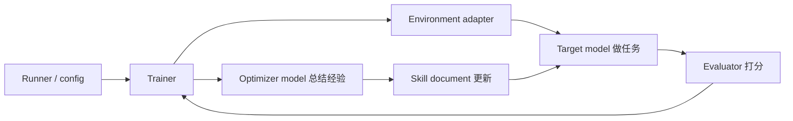
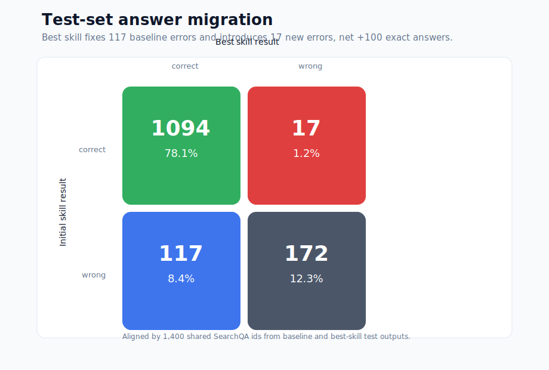
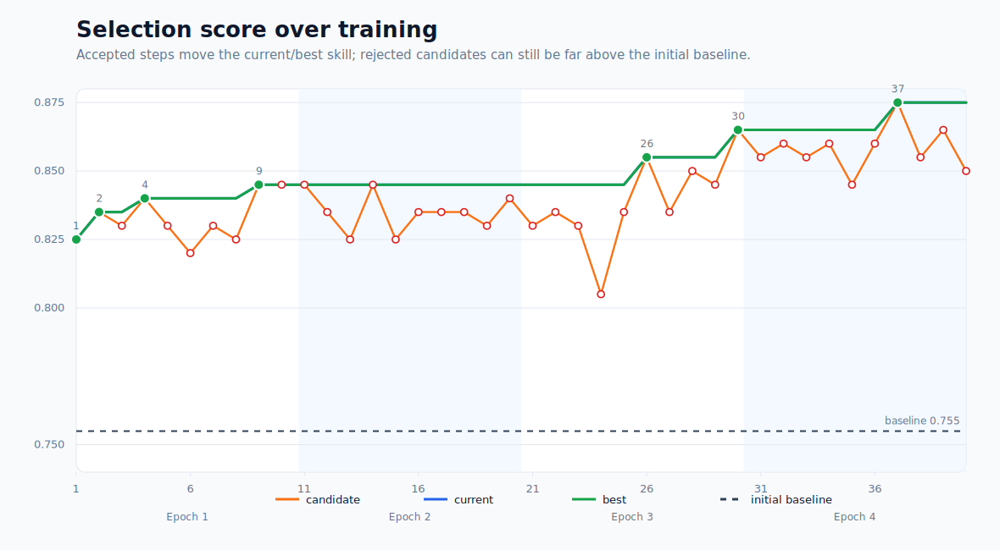
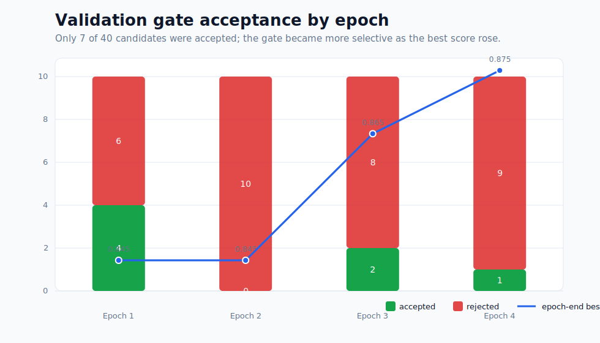
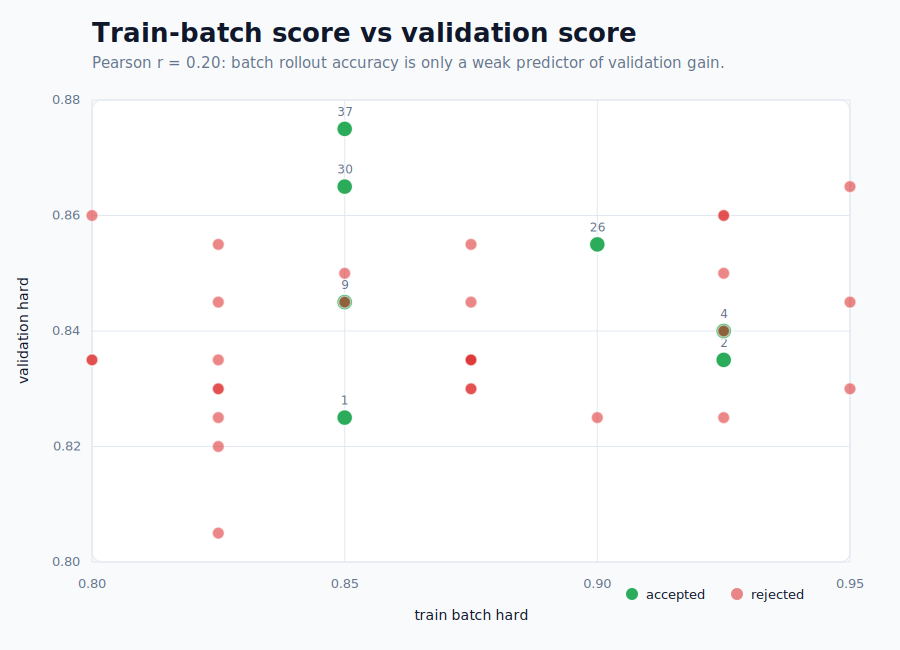
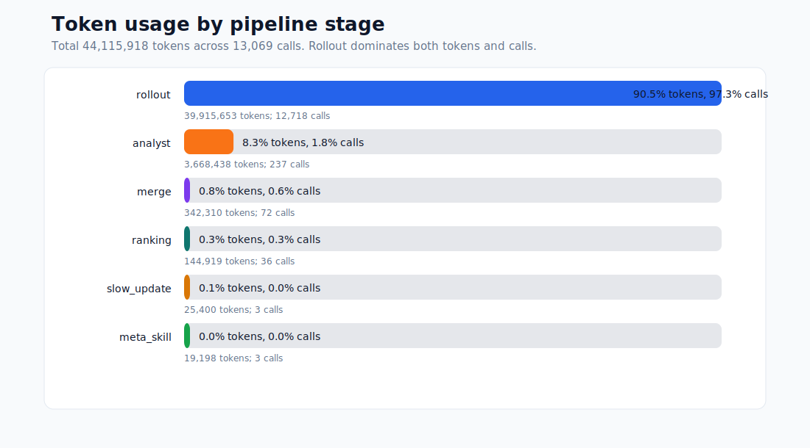
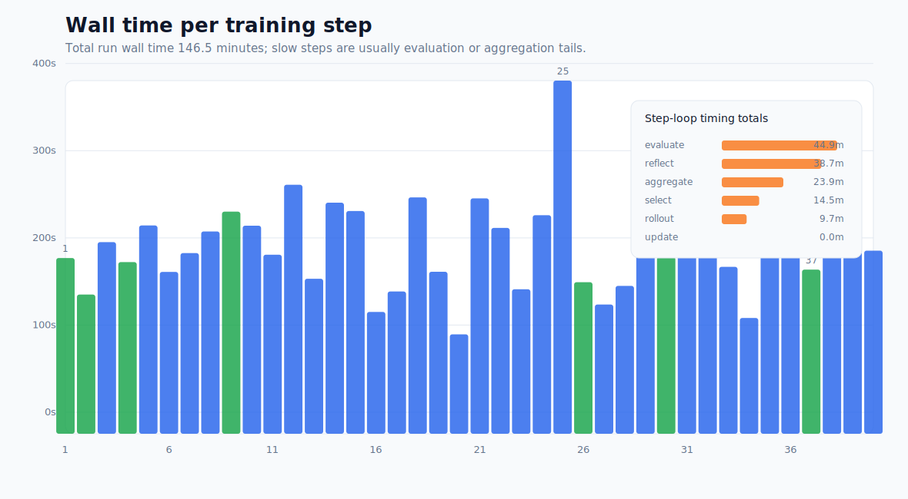
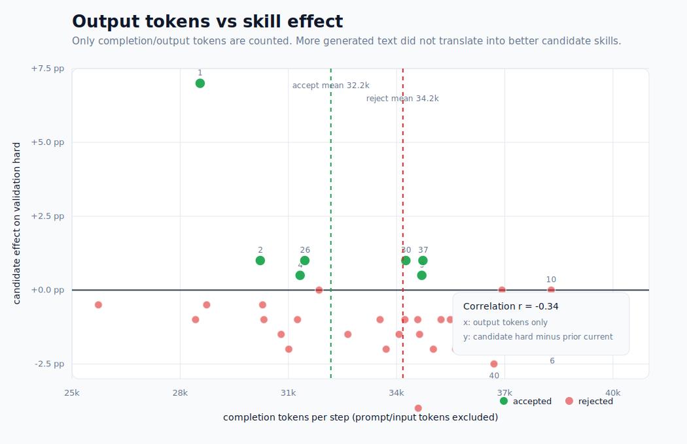
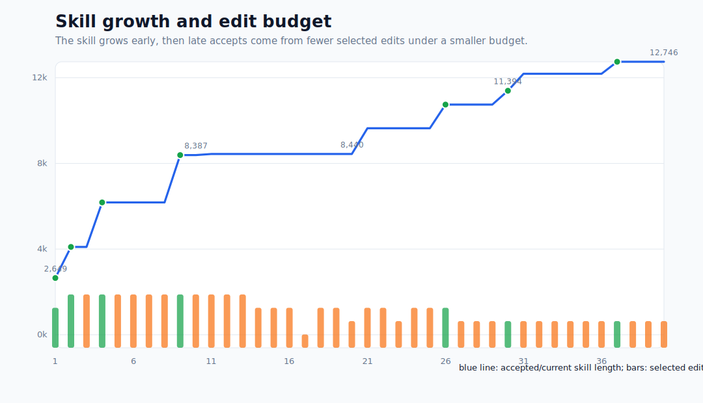

# SkillOpt SearchQA 实验流程与实现概览

本次组会分享 SkillOpt repo 如何通过 SearchQA 实验实现“自动优化 agent skill”的完整流程，重点包括：

- SkillOpt 想解决什么问题；
- repo 里哪些模块分别负责什么；
- SearchQA 实验如何把这些模块串起来；
- 一次真实实验最后得到了什么结果。

## 一句话理解

SkillOpt 把一个 agent 的“做题经验”写成 Markdown skill，然后像训练神经网络一样反复优化这个 skill：

```text
做一批题 -> 看哪些对/错 -> 总结规律 -> 修改 skill -> 在验证集上检查 -> 接受或拒绝
```

它不微调模型参数。模型本身不变，变的是输入给模型的 skill 文档。

## 为什么需要 SkillOpt

大模型 agent 经常需要长期积累经验。例如：

- 在 SearchQA 里，模型需要学会怎样从检索片段里抽取短答案；
- 在 ALFWorld 里，模型需要学会怎样按步骤操作环境；
- 在 spreadsheet 或 document QA 里，模型需要学会怎样使用工具、避免常见格式错误。

手写 prompt/skill 有两个问题：

- 人工总结经验慢，而且容易只覆盖自己看到的少数 case；
- skill 越改越长后，很难判断某条规则到底有没有提升泛化表现。

SkillOpt 的想法是：把 skill 当成可训练对象，用实验循环自动产生、筛选和保留有效规则。

## 类比神经网络训练

这个 repo 里很多命名来自深度学习，但对象换成了 skill 文档。

| 神经网络训练 | SkillOpt 中对应的东西 |
| --- | --- |
| 模型权重 | Markdown skill 文档 |
| mini-batch | 一批任务轨迹，例如 40 个 SearchQA 问题 |
| forward / rollout | 让 target model 根据当前 skill 做题 |
| loss / metric | `hard` Exact Match、`soft` token-level F1 |
| gradient | optimizer model 从失败/成功轨迹中总结出的 skill edits |
| learning rate | 每步最多应用多少条 edit |
| validation gate | 候选 skill 只有验证集变好才接受 |
| checkpoint | `best_skill.md`, `history.json`, `runtime_state.json` |

所以 SkillOpt 更像“prompt/skill 的训练框架”，不是传统 fine-tuning 框架。

## Repo 里有哪些角色

可以把系统分成五个角色。



| 角色 | 在 repo 中的位置 | 负责什么 |
| --- | --- | --- |
| Runner | [scripts/run_searchqa.sh](../scripts/run_searchqa.sh) | 给实验一个正式入口，加载 `.env`，指定配置和输出目录。 |
| Config | [configs/searchqa/default.yaml](../configs/searchqa/default.yaml) | 定义 SearchQA 实验的模型、数据、训练轮数、batch size、评测设置。 |
| Trainer | [skillopt/engine/trainer.py](../skillopt/engine/trainer.py) | 编排完整训练循环：rollout、reflect、merge、select、update、evaluate。 |
| SearchQA adapter | [skillopt/envs/searchqa/adapter.py](../skillopt/envs/searchqa/adapter.py) | 把通用训练循环接到 SearchQA 数据、prompt、evaluator 上。 |
| Rollout/eval | [rollout.py](../skillopt/envs/searchqa/rollout.py), [evaluator.py](../skillopt/envs/searchqa/evaluator.py) | 让 target model 回答问题，并计算 EM/F1。 |
| Optimizer prompts | [skillopt/prompts](../skillopt/prompts) 和 [SearchQA prompts](../skillopt/envs/searchqa/prompts) | 告诉 optimizer model 如何分析轨迹、合并 edits、排序 edits。 |

一句话：`trainer.py` 是主控，`envs/searchqa/` 是 SearchQA 适配层，`prompts/` 是 optimizer 的工作说明书。

## SearchQA 任务是什么

SearchQA 的每个样本由三部分组成：

```json
{
  "question": "问题",
  "context": "[DOC] 检索到的多个文本片段 ...",
  "answers": ["标准答案"]
}
```

target model 看到 `context + question + 当前 skill`，然后输出：

```xml
<answer>短答案</answer>
```

评测时：

- `hard` 是 Exact Match；
- `soft` 是 token-level F1；
- evaluator 会做 SQuAD-style normalization，例如小写、去标点、去掉 `a/an/the`。

## 这次实验用的关键设置

完整配置在 [configs/searchqa/default.yaml](../configs/searchqa/default.yaml) 和
[configs/_base_/default.yaml](../configs/_base_/default.yaml)。关键设置如下：

| 设置 | 值 | 怎么理解 |
| --- | ---: | --- |
| target model | `gpt-5.5` | 实际做 SearchQA 的模型。 |
| optimizer model | `gpt-5.5` | 负责读轨迹、总结规则、修改 skill 的模型。 |
| train / val / test | 400 / 200 / 1400 | train 用来产生经验，val 用来决定接不接受，test 只在最后看泛化。 |
| epochs | 4 | 对 400 个 train items 跑 4 轮。 |
| batch size | 40 | 每一步看 40 道题。 |
| steps | 40 | 每 epoch 10 steps，总共 40 steps。 |
| edit budget | 4 -> 2 | 每步最多保留几条 skill 修改，后期逐渐变保守。 |
| slow update | on | 每个 epoch 末做一次跨 epoch 总结。 |
| meta skill | on | 给 optimizer 自己写一份“以后怎么改 skill 更好”的记忆。 |

一个容易误解的点：这里的 `learning_rate` 不是模型参数学习率，而是“每步最多应用多少条 skill edit”。

## 一次训练循环怎么跑

### 1. 从一个几乎空的 skill 开始

初始文件是 [initial.md](../skillopt/envs/searchqa/skills/initial.md)：

```md
# Question Answering Skill

(No learned rules yet. Rules will be added through the reflection process.)
```

也就是说，一开始几乎没有任务经验。

### 2. 先测一次初始 skill

训练前先在 validation split，也就是 `valid_seen` 上测 `S0`。

这个分数作为 baseline，也作为之后是否接受候选 skill 的起点。

### 3. 做一批 train 题

trainer 抽 40 个 train items，让 target model 带着当前 skill 去回答。

每道题都会保存：

- target model 看到的 system prompt；
- target model 看到的 user prompt；
- target model 的回答；
- evaluator 给出的对错和 F1。

这些文件后来会变成 optimizer model 分析失败/成功模式的证据。

### 4. 让 optimizer 总结失败和成功模式

SkillOpt 不只看错题，也看对题。

- 失败轨迹：找 common failure pattern，例如“答案太长”“重复了题干已有词”“选了文章标题而不是 slot value”。
- 成功轨迹：找 common success pattern，例如“只返回缺失短语”“根据 clue 的 placeholder 判断答案类型”。

optimizer 输出的不是自然语言建议，而是结构化 JSON patch，例如：

```json
{
  "patch": {
    "reasoning": "Several failures repeat the clue's supplied words.",
    "edits": [
      {
        "op": "append",
        "content": "- When the clue already supplies part of the answer phrase, return only the missing component."
      }
    ]
  }
}
```

### 5. 合并、排序、应用 edits

一个 batch 可能产生很多 edits。SkillOpt 会：

1. 合并相似 edits；
2. 优先保留 failure-driven edits；
3. 根据 edit budget 选最重要的几条；
4. 把这些 edits 应用到当前 skill，得到 candidate skill。

这里的设计意义是：optimizer 可以提出很多想法，但最后只有少数被真正尝试。

### 6. 在 validation 上决定接受还是拒绝

candidate skill 不会直接成为新 skill。它必须在 `valid_seen` 上超过当前 skill：

```text
如果 candidate_hard > current_hard：接受
否则：拒绝
```

注意是严格大于，所以打平也会拒绝。这个 gate 避免 skill 越改越差。

### 7. Epoch 末做 Slow Update

普通 step 只看当前 batch 的局部现象。epoch 末还有两种更长期的机制。

**Slow update** 会拿同一批 20 道 train 题，对比“上一 epoch skill”和“当前 epoch skill”的表现：

- 以前错现在对：`improved`
- 以前对现在错：`regressed`
- 前后都错：`persistent_fail`
- 前后都对：`stable_success`

然后写一段 protected guidance 到 skill 末尾，帮助 target model 防止长期漂移。

**Meta skill** 不写给 target model，而是写给 optimizer model。它记录“以后写 edits 时应该注意什么”，例如哪些规则太具体、哪些抽象层级更有效。

## Prompt 长什么样

SearchQA 实验里最重要的是两类 prompt：target prompt 负责让模型做题，optimizer prompt 负责让模型根据轨迹修改 skill。

### Target prompt：让模型做题

target model 的 system prompt 大概是：

```md
You are an expert question answering agent.

## Skill
<当前 skill 文档>

## Task Format
You will receive a CONTEXT containing document passages and a QUESTION.

## Answer Format
Think step by step, then provide your final answer inside <answer>...</answer> tags.
Keep your answer concise.
```

user prompt 大概是：

```md
## Context
<检索片段>

## Question
<问题>
```

### Optimizer prompt：让模型改 skill

optimizer model 看到的是很多条 trajectory，而不是原始 dataset 表格。它的输入大概是：

```md
## Current Skill
<当前 skill>

## Edit Budget
Produce at most L=4 edits.

## Failed Trajectories
### Trajectory 1
Question: ...
Target answer: ...
Model answer: ...
Evaluation: Exact Match = 0

### Trajectory 2
...
```

它的输出必须是 JSON patch。这样 trainer 才能自动合并、排序、应用。

## 一个真实 SearchQA 例子

下面这个例子来自真实输出目录：
`outputs/skillopt_searchqa_gpt-5.5_20260529_235037/test_eval_baseline/predictions/7472c5a21123400596962aec79a5e9b3/`
和
`outputs/skillopt_searchqa_gpt-5.5_20260529_235037/test_eval/predictions/7472c5a21123400596962aec79a5e9b3/`。

题目是：

```text
A type of camera:TLR
```

context 里有一段关键信息：

```text
A twin-lens reflex camera (TLR) is a type of camera ...
TLR stands for Twin Lens Reflex.
```

gold answer 是：

```md
Twin-lens reflex
```

题目里已经说了“a type of camera”，所以最终答案只需要解释
`TLR` 代表什么，不应该再把 `camera` 重复一遍。

初始 skill 几乎没有任务经验，所以 target model 输出了完整名词短语：

```xml
<answer>Twin-lens reflex camera</answer>
```

这个回答语义上很接近，F1 也有 0.8，但多了题目已经给出的类别词 `camera`，
所以 Exact Match 仍然是 0.0。

训练后的 best skill 学到了一类更适合 SearchQA/Jeopardy 的规则：
如果题目已经给出泛化类别或答案短语的一部分，最终只返回缺失的关键 slot value。
它在 `best_skill.md` 里体现为类似这样的规则：

```text
Answer with the shortest unambiguous phrase that fills the clue.
```

因此同一个样本在 best skill 下输出：

```xml
<answer>Twin-lens reflex</answer>
```

这次 evaluator 给出 `Exact Match = 1.0`, `F1 = 1.0`。

| 阶段 | 输出 | EM | F1 |
| --- | --- | ---: | ---: |
| 初始 skill | `Twin-lens reflex camera` | 0.0 | 0.8 |
| Best skill | `Twin-lens reflex` | 1.0 | 1.0 |

这个例子展示了 SkillOpt 学到的不是某个题目的答案，而是一类更通用的 SearchQA
答题习惯：答案要足够短，刚好填上题目缺失的部分；多答一个看似无害的类别词，
在 exact-match 评测里也会从正确变成错误。

## 真实完整实验结果

完整 run 输出目录：
`outputs/skillopt_searchqa_gpt-5.5_20260529_235037/`。

| 指标 | 初始 skill | 训练后 best skill |
| --- | ---: | ---: |
| Validation hard | 0.7550 | 0.8750 |
| Test hard | 1111/1400 = 0.7936 | 1211/1400 = 0.8650 |
| Test soft | 0.8925 | 0.9264 |
| Test hard 提升 | - | +0.0714 |

训练过程：

| Epoch | Steps | Accepted | Rejected | Epoch-end best hard |
| --- | --- | ---: | ---: | ---: |
| 1 | 1-10 | 4 | 6 | 0.8450 |
| 2 | 11-20 | 0 | 10 | 0.8450 |
| 3 | 21-30 | 2 | 8 | 0.8650 |
| 4 | 31-40 | 1 | 9 | 0.8750 |

几个观察：

- 大多数候选 edits 被拒绝，说明 validation gate 很重要；
- 最好的 skill 出现在 step 37；
- test hard 从 0.7936 提升到 0.8650，说明学到的规则有 held-out 泛化；
- 最终 skill 不是短 prompt，而是一份包含多类 SearchQA 答题经验的文档：[best_skill.md](../outputs/skillopt_searchqa_gpt-5.5_20260529_235037/best_skill.md)。

## 输出目录怎么看

主要输出文件如下：

| 文件/目录 | 看什么 |
| --- | --- |
| `config.json` | 这次实验真正使用的完整配置。 |
| `history.json` | 每个 step 的分数、接受/拒绝、耗时、token 使用。 |
| `best_skill.md` | 最终学到的 skill。 |
| `summary.json` | 最终指标、best step、总 token、epoch stats。 |
| `steps/step_XXXX/` | 某一步如何从 rollout 到 candidate skill。 |
| `test_eval/results.jsonl` | best skill 在 test split 上每道题的结果。 |

这套输出也支持续跑：`runtime_state.json` 记录最后完成的 step，`results.jsonl` 记录已经完成的样本，已有的 patch/result 文件会被复用。

## 代码阅读路径

理解这套实现时，可以按以下顺序阅读代码：

1. [scripts/run_searchqa.sh](../scripts/run_searchqa.sh)：实验怎么启动。
2. [configs/searchqa/default.yaml](../configs/searchqa/default.yaml)：实验规模和默认参数。
3. [skillopt/engine/trainer.py](../skillopt/engine/trainer.py)：完整训练循环。
4. [skillopt/envs/searchqa/rollout.py](../skillopt/envs/searchqa/rollout.py)：target model 如何看到题目并回答。
5. [skillopt/envs/searchqa/evaluator.py](../skillopt/envs/searchqa/evaluator.py)：`hard` / `soft` 怎么算。
6. [skillopt/gradient/reflect.py](../skillopt/gradient/reflect.py)：如何把多条 trajectory 变成 optimizer prompt。
7. [skillopt/optimizer](../skillopt/optimizer)：如何 merge、rank、apply edits。

## 核心结论

1. SkillOpt 的训练对象是 skill 文档，不是模型参数。
2. 它用“trajectory -> reflection -> edit -> validation gate”的循环，让 skill 自动积累经验。
3. SearchQA 实验展示了这种方法能把零散答题经验沉淀成可复用规则，并在 held-out test 上带来提升。

## 实验日志深度分析

本节基于完整输出目录
`outputs/skillopt_searchqa_gpt-5.5_20260529_235037/` 中的
`summary.json`、`history.json`、`test_eval/results.jsonl`、
`test_eval_baseline/results.jsonl`、`slow_update/*/slow_result.json` 和
`meta_skill/*/meta_skill_result.json` 做进一步分析。

图表由 [scripts/dev/analyze_searchqa_run.py](../scripts/dev/analyze_searchqa_run.py)
生成，派生统计保存在
[analysis_summary.json](assets/searchqa_analysis/analysis_summary.json)。

生成命令：

```bash
uv run python scripts/dev/analyze_searchqa_run.py
```

### 总体收益：不是只多对几题，而是学到了一类答题习惯

| 指标 | 初始 skill | Best skill | 变化 |
| --- | ---: | ---: | ---: |
| Validation hard | 0.7550 | 0.8750 | +12.00 pp |
| Test hard | 1111/1400 = 0.7936 | 1211/1400 = 0.8650 | +100 题 / +7.14 pp |
| Test soft | 0.8925 | 0.9264 | +3.39 pp |
| Skill 文件大小 | 104 B | 14,083 B | 从空规则变成经验文档 |

Validation 增幅比 test 增幅更大，这是合理现象：候选 skill 是在 validation
上被选择的，validation 本身承担了筛选压力。关键是 held-out test 仍然多对
100 道题，说明学到的不是单纯 validation 记忆，而是能迁移到未见问题的
SearchQA 答题规则。



从 1400 个 test 样本逐题对齐看，best skill 修好了 117 个初始 skill
答错的问题，同时引入了 17 个新错误，净增 100 个 exact-match 正确答案。
这比只看最终 hard 更有信息量：skill 的收益不是均匀地让所有题都变好，而是集中修复了一批“答案边界/表面形式”问题。

### 得分动态：早期收益快，后期收益稀疏



40 个 candidate 的 validation hard 全都高于初始 baseline 0.7550；最低的
candidate 也有 0.8050。但只有 7 个 candidate 被接受，因为 gate 比较的是
“是否严格超过当前 skill”，不是“是否超过初始 skill”。

这说明 validation gate 的作用不是过滤明显无效的修改，而是防止相对退化。
**candidate可能导致严重退化。**



训练节奏可以分成三段：

- Epoch 1 快速吸收明显规则：step 1、2、4、9 被接受，best hard 从 0.7550
  提升到 0.8450。
- Epoch 2 完全平台期：10 个 candidate 全部被拒绝，说明第一轮之后，
  “容易学”的格式规则已经基本吃完，局部 batch 上产生的新 edits 很难再稳定提升。
- Epoch 3/4 进入稀疏改进阶段：step 26、30、37 才继续刷新 best，
  最终 step 37 达到 0.8750。

另一个细节是严格接受规则很重要。step 10、11、14 都打平当前分数但被拒绝。
如果打平也接受，skill 会发生无收益漂移，后续分析也更难判断哪条规则真正有效。

### Batch 表现不能直接代表泛化



每一步都会先在 train batch 上 rollout，再在 validation 上检查 candidate。
这两个分数的 Pearson 相关系数只有 0.20，说明 train batch hard 对 validation
hard 的预测能力很弱。

**同样说明部分paper的单benchmark多轮迭代evolve不合理。**

这点对理解 SkillOpt 很关键：optimizer 看到的是一个 batch 的轨迹，因此它提出的
edits 很可能只解释当前 batch。只有 validation gate 才能判断这些 edits 是否真的泛化。

两个例子：

- Step 2 的 train batch hard 是 0.925，validation hard 是 0.835。它被接受，
  但主要因为当前 skill 还处在早期低分阶段。
- Step 37 的 train batch hard 只有 0.850，却在 validation 上达到 0.875，
  成为最终 best。也就是说，当前 batch 表现不突出，不代表 edit 没有泛化价值。

### 样本迁移：主要收益来自“更短、更像答案键”的输出

| Baseline -> Best | 样本数 | 含义 |
| --- | ---: | --- |
| 对 -> 对 | 1094 | 已经会的题基本保持住。 |
| 错 -> 对 | 117 | 新 skill 修复的主要收益来源。 |
| 对 -> 错 | 17 | 新 skill 引入的回归。 |
| 错 -> 错 | 172 | 仍未解决的问题池。 |

F1 层面也能看到同一趋势：123 个样本 soft 分数提高，27 个样本下降，
1250 个样本不变。也就是说，大多数题的答案完全没受影响，收益集中在一小批
原本边界不准的题上。

典型修复如下：

| 问题 | Gold | 初始 skill 输出 | Best skill 输出 | 变化 |
| --- | --- | --- | --- | --- |
| Cure-all | `panacea` | `A remedy or solution for any illness or problem` | `panacea` | 从定义句变成短答案。 |
| The Ridgeline | `Honda` | `a sport utility truck by Honda` | `Honda` | 去掉描述，只保留实体。 |
| Lake Kissimmee | `Florida` | `A lake in Florida, about 15 miles east of Lake Wales` | `Florida` | 从解释性短句抽取 slot value。 |
| A type of camera:TLR | `twin lens reflex` | `Twin-lens reflex camera` | `Twin-lens reflex` | 去掉多余类别词。 |
| Wyoming:"Equal" these | `rights` | `Equal Rights state` | `Rights` | 返回题目缺失部分。 |

这些例子共同指向一个规律：SearchQA/Jeopardy 风格问题经常不是问“完整解释”，而是问一个很短的答案键。SkillOpt 学到的核心能力之一，就是把模型从“解释型回答”拉回到“答案键型回答”。

回归样本也很有启发：

| 问题 | Gold | 初始 skill 输出 | Best skill 输出 | 暴露的问题 |
| --- | --- | --- | --- | --- |
| Bad, bad Leroy Brown was meaner than this kind of dog | `a junkyard dog` | `junkyard dog` | `junkyard` | 过度裁剪，把必要名词删掉了。 |
| Richard the Lionhearted had a favorite one of these minstrels named Blondel | `a troubadour` | `troubadour` | `troubadours` | 单复数表面形式出错。 |
| Considered a national dish, feijoada comes from the Portuguese word for this legume | `beans` | `beans` | `bean` | 为了简洁而错误 singularize。 |
| The Montana Grizzlies are in this athletic conference, also a nickname for the state | `the Big Sky Conference` | `Big Sky Conference` | `Big Sky` | 去掉了答案键需要保留的类别词。 |

所以 best skill 的主收益和主风险来自同一个方向：它更敢裁剪答案。裁剪能修好很多冗长回答，但也会在少数题上删掉必要词。

### 成本结构：最贵的不是 optimizer，而是反复 rollout/eval



这次实验总共使用 44,115,918 tokens、13,069 次模型调用。token 分布非常不均衡：

| 阶段 | Tokens | Token 占比 | Calls | Call 占比 |
| --- | ---: | ---: | ---: | ---: |
| Rollout / eval | 39,915,653 | 90.5% | 12,718 | 97.3% |
| Analyst reflection | 3,668,438 | 8.3% | 237 | 1.8% |
| Merge | 342,310 | 0.8% | 72 | 0.6% |
| Ranking | 144,919 | 0.3% | 36 | 0.3% |
| Slow update + meta skill | 44,598 | 0.1% | 6 | <0.1% |

这说明在当前实现里，成本瓶颈不是“optimizer 想得太多”，而是 target model
被大量调用来做 train rollout、validation selection 和 final test。优化成本时，
优先级应该是：

1. 减少或自适应 selection eval 的样本数；
2. 对候选 skill 做分阶段筛选，先小 validation，再全 validation；
3. 更充分复用已有 results/cache；
4. 对明显低质量 candidate 做 early stop。

只优化 merge/ranking prompt 的 token，收益会比较有限，因为它们合起来只占约 1.1%。

### 运行时间：慢 step 往往不带来接受



40 个训练 step 的累计 wall time 约 7,899.8 秒；完整 run wall time 是
8,790.0 秒，额外时间来自初始 baseline、最终 test、epoch 级 slow/meta 等非 step
主循环工作。

最慢的 step 是：

| Step | Wall time | Action | Selection hard | 主要耗时 |
| --- | ---: | --- | ---: | --- |
| 25 | 380.4s | reject | 0.835 | evaluate 148.0s + aggregate 111.0s |
| 32 | 303.3s | reject | 0.860 | evaluate 138.9s + select 56.2s |
| 31 | 277.3s | reject | 0.855 | evaluate 153.7s |
| 35 | 273.3s | reject | 0.845 | evaluate 131.6s |

这些慢 step 全部被拒绝。换句话说，高运行成本不一定带来高价值更新；
full validation gate 虽然保证安全，但也会把大量时间花在最终拒绝的 candidate 上。
这再次支持“先便宜筛选，再昂贵确认”的后续实验方向。

### 输出更多 token 不代表 skill 更新更有效

单看 wall time 还不够，因为一个 step 慢可能来自网络尾延迟、并发调度、评测排队等原因。
更直接的成本指标是模型实际生成了多少内容。这里单独统计每个 step 的
`completion_tokens`，也就是输出 tokens；`prompt_tokens` / 输入 tokens
不计入这张图。



图里的横轴是每个 step 的输出 tokens，纵轴是 candidate skill 相对 step 前
current skill 的 validation hard 变化：

```text
effect = candidate_selection_hard - previous_current_hard
```

所以纵轴大于 0 才表示这个 candidate 真正比当前 skill 更好；纵轴等于 0
表示打平，会被 strict gate 拒绝；纵轴小于 0 表示 candidate 退化。

| 统计 | 数值 | 怎么理解 |
| --- | ---: | --- |
| completion tokens vs effect 的相关系数 | -0.34 | 输出更多 token 没有带来更好更新，反而略呈负相关。 |
| completion tokens vs selection hard 的相关系数 | 0.14 | 只看 candidate 绝对分数，也几乎看不到正相关。 |
| 被接受 step 平均输出 tokens | 32.2k | 真正提升 current skill 的 step 平均更省 token。 |
| 被拒绝 step 平均输出 tokens | 34.2k | 被拒绝 step 反而平均输出更多。 |
| 正 / 平 / 负 effect step | 7 / 3 / 30 | 只有 7 个 candidate 真正超过当前 skill。 |

最“贵”的几个输出-token step 并没有产生更好 skill：

| Step | 输出 tokens | Effect | Action |
| --- | ---: | ---: | --- |
| 39 | 39,683 | -1.0 pp | reject |
| 6 | 38,311 | -2.0 pp | reject |
| 10 | 38,288 | 0.0 pp | reject |
| 38 | 38,208 | -2.0 pp | reject |

相反，最终最佳更新 step 37 使用 34,731 个输出 tokens，effect 是 +1.0 pp；
早期提升最大的 step 1 只使用 28,554 个输出 tokens，但 effect 是 +7.0 pp。
step 1 的大提升当然部分来自起点低，不能说明越少越好；但它足以说明：
“生成更多内容”本身不是 skill 变好的充分条件。

这个结果不应解读成输出 token 会导致效果变差，因为这不是受控因果实验。
更合理的解释是：低质量 candidate 即使生成了更多分析、更多答案、更多 patch，
也可能只是更长的无效探索；真正有效的是能被 validation 支持的规则，而不是生成文本的长度。

### Skill 增长：越到后期，越需要少而准的 edits



Skill 从初始 104 B 增长到 14,083 B。早期 edit budget 是 4，step 1/2/4/9
都能接受较多 edits；后期 budget 降到 3，再降到 2。最后的关键 step 37
只选择了 2 条 edits，而且两条的 support count 都是 8。

这说明后期有效更新更像“高置信、小步修补”，而不是继续大规模扩写。随着 skill
变长，每条新规则都要和已有规则共存；太宽泛的规则更容易引入回归，比如过度裁剪、
错误单复数、错误删掉类别词。

### Slow update 和 meta skill 暗示了最后的瓶颈

Epoch 2 和 epoch 3 的 slow update 在抽样 train 对比上都没有提升
hard：上一 epoch 与当前 epoch 都是 0.8500，且 `regressed=0`、
`improved=0`、`persistent_fail=3`、`stable_success=17`。这类 update
更像是在巩固安全规则，而不是马上带来新分数。

Epoch 4 的 slow update 从 0.7500 提升到 0.8000，有 1 个 improved、0 个
regressed。它总结出的重点集中在答案表面形式：

- 不要把 Jeopardy 风格答案自动扩写成百科全名；
- 人名不要随意加 middle initial 或额外 given name；
- title、periodical、honorific、plural instrument、gerund 等形式要保留答案键需要的表面形态；
- 最后裁剪答案时要保守，只在证据明确时删词。

Meta skill 的结论也类似：后续 optimizer 应优先修复 near-miss EM 的 compact
normalization，不要在实体已经找对时再加入宽泛检索规则。

这给出的启示很明确：这次 SearchQA run 后期的瓶颈已经不是“找不到证据”，而是
“答案表面形式是否刚好匹配答案键”。SkillOpt 在这个任务上学到的核心经验，最终收敛到
一种很细的 QA formatting policy。

### 关键启示

1. **Validation gate 是必要组件。** 40 个 candidate 全都超过初始 baseline，
   但只有 7 个真正提高当前 skill；没有 gate，skill 很可能不断漂移。
2. **训练 batch 不能替代 validation。** Rollout hard 与 selection hard 的相关性只有
   0.20，说明 batch 内成功不等于 held-out 泛化。
3. **主要收益来自答案边界控制。** 修复样本大多是“冗长解释 -> 短答案键”；
   回归样本大多是“裁剪过头”或“表面形式变错”。
4. **成本瓶颈在 target model 调用。** Rollout/eval 占 90.5% tokens 和 97.3%
   calls，后续若要降成本，应优先优化评测策略，而不是只压缩 optimizer prompt。
5. **更多输出 token 不等于更好更新。** 每 step completion tokens 与 candidate
   effect 的相关系数是 -0.34；被拒绝 step 平均输出 tokens 还略高于被接受 step。
6. **后期更新要少而准。** Step 37 只接受 2 条高支持 edits，却刷新最终 best；
   这说明长 skill 的后期优化更需要 guarded rules，而不是继续大范围加规则。
